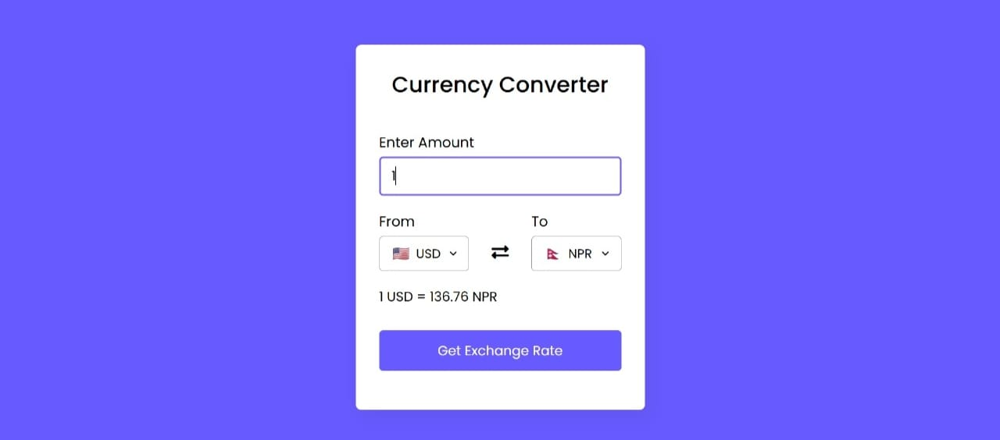

# 💱 Currency Converter 🌍

A simple and responsive web application to convert currencies in real time. Built using HTML, CSS, and JavaScript, this tool fetches live exchange rates via API and provides an intuitive interface for fast currency conversions.

---

## 🖥️ Demo

**App Preview**

---

## 🚀 Live Demo

Check out the app live at:  
🔗 [Live Demo - Currency Converter](https://luminous-dango-73bfdc.netlify.app)

---

## ✨ Features

- 🔄 Real-time exchange rate conversion  
- 🌐 Supports multiple currencies  
- 🧭 Easy and responsive UI  
- 📥 Input validation  
- 💡 User-friendly layout

---

## 📂 Folder Structure

├── index.html
├── style.css
├── script.js
├── currencyconverter.jpg
└── README.md

---

## 🛠️ Tech Stack

- 💻 HTML5  
- 🎨 CSS3  
- ⚙️ JavaScript (Fetch API)

---

## 💡 Future Enhancements

- 📊 Historical exchange rate chart  
- 🌙 Dark mode toggle  
- 🌐 Offline support with cached data  
- 🔔 Notification on rate change

---

## 👩‍💻 About Me

### Ganta Jigeesha

🎓 3rd Year CSE Student @ VVIT, Guntur  
💻 Full Stack Developer | Java, React, PostgreSQL  
☁️ Completed Cloud Internships through Eduskills & AICTE  
🌱 Currently exploring Spring Boot & REST APIs

---

## 📬 Contact

- 📧 Email: [gantajigeesha2005@gmail.com]  
- 🔗 LinkedIn: (https://www.linkedin.com/in/gantajigeesha/)

---

💡 *“Code. Learn. Build. Repeat.”*
